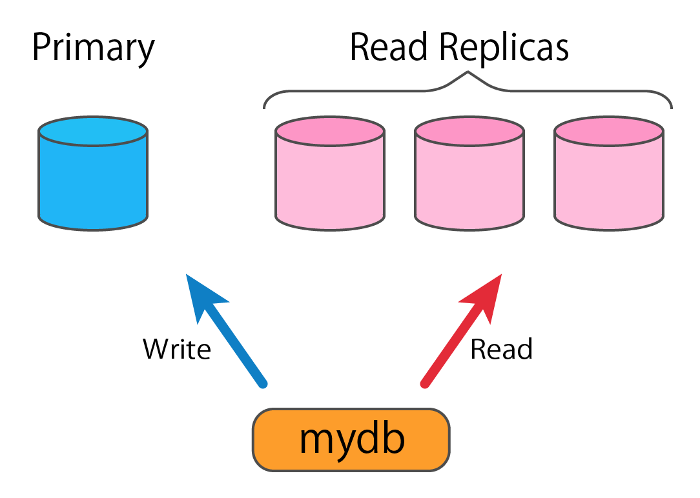

# Background

You are part of a team developing a web service that uses a managed MySQL DB from a public cloud provider with 1 primary DB and multiple read replicas to spread the load.

The team is working on a library that can be used in the same way as the `DB` type from the `database/sql` package.
The purpose of this library is to automatically route read-only queries to read replicas, and all other queries to the primary DB (see diagram), without the user having to be aware of it.



The public cloud provider will perform automatic maintenance on the DBs with the following conditions: 

* During maintenance, the affected DB will not be available and will get restarted
* For the primary DB, the team can set a maintenance window during which the public cloud provider will perform maintenance
* For the read replicas, maintenance can happen at any time (no maintenance window setting possible) 
* The implementation should take downtime into considerations as it occasionally happens on public cloud services.

There is also a request for this `mydb` package to be provided for other than this web service, as other teams are planning to use MySQL.
In order to provide it as a library for other teams, etc., it should be defined as a library, and dependency management and documentation should be taken care of.

It has come to light that the package, `mydb.go`, contains some issues which need urgent attention.

# Your Tasks

## Task 1

Consider the following points for the current state of the library.

e.g.
* Does the library fulfill the requirements described in the background section?
* Is the library easy to use?
* Is the code quality assured?
* Is the code readable?
* Is the library thread-safe?

Write down any issues you see.

## Task 2

Resolve the issues discovered in the previous task by fixing the code.

You may, within reason:

* Use external libraries
* Add files or directories
* Rename functions, change parameters, and make other destructive changes
* However, the following interfaces should be satisfied (the same as those defined in [here](interface_test.go#L10-L27))

```go
interface {
	Ping() error
	PingContext(ctx context.Context) error
	Query(query string, args ...interface{}) (*sql.Rows, error)
	QueryContext(ctx context.Context, query string, args ...interface{}) (*sql.Rows, error)
	QueryRow(query string, args ...interface{}) *sql.Row
	QueryRowContext(ctx context.Context, query string, args ...interface{}) *sql.Row
	Begin() (*sql.Tx, error)
	BeginTx(ctx context.Context, opts *sql.TxOptions) (*sql.Tx, error)
	Close() error
	Exec(query string, args ...interface{}) (sql.Result, error)
	ExecContext(ctx context.Context, query string, args ...interface{}) (sql.Result, error)
	Prepare(query string) (*sql.Stmt, error)
	PrepareContext(ctx context.Context, query string) (*sql.Stmt, error)
	SetConnMaxLifetime(d time.Duration)
	SetMaxIdleConns(n int)
	SetMaxOpenConns(n int)
}
```

Ensure that it works on Go stable versions.

## Task 3

Explain what you did in the previous task and your reasoning behind it.

## When Submitting Your Answers

Please commit your code on the `master` branch in the specified GitHub repository.

Additionally, the following two files must be included:

* `answer.md`: your answers for Tasks 1 and 3
*  A set of source code that answers for Task 2

Please note that responses to GitHub issues, Pull Requests, comments etc., as well as branches other than the `master`, will not be taken into consideration.
