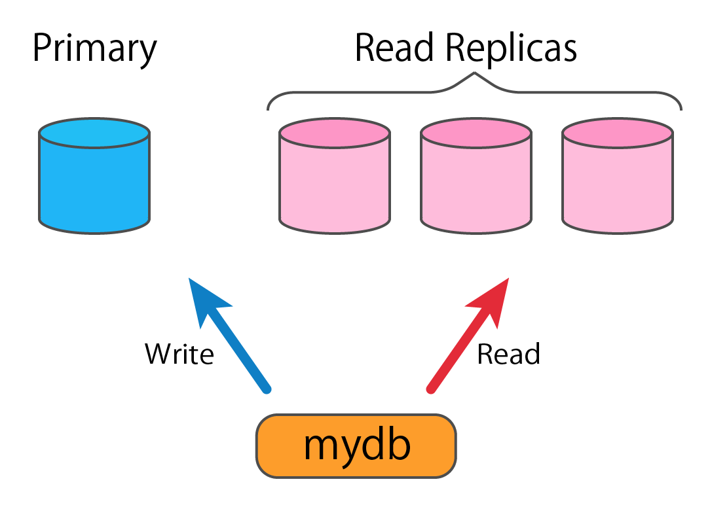

# 背景

あるチームでは、開発しているWebサービスにMySQLを利用しようと考えている。
DBはあるパブリッククラウドサービスのマネージドサービスを利用し、Primary1つと負荷分散のためRead Replicaを複数台用意する予定である。

PrimaryおよびRead Replicaはパブリッククラウドサービスによる不定期なメンテナンスによって再起動することがある。
これらの事項を考慮し、パブリッククラウドサービスの一部が停止することも想定して実装を行うこと。

DBに接続するにあたって、チームのメンバーにPrimaryとRead Replicaを意識させず、
`database/sql`パッケージのDB型と同じように使えるライブラリを用意したいと考えた。
つまり、ライブラリの利用者はPrimaryとRead Replicaのどちらにリクエストを送るのか意識する必要はないが、
ライブラリ内部では、下図のように読み込み系のクエリの場合はRead Replicaにリクエストを送り、それ以外はPrimaryにリクエストを送るようにしたい。



そこで、このチームでは`mydb`パッケージというライブラリを開発を行った（`mydb.go`として添付してあるもの）。
しかし、`mydb`パッケージは問題やバグを抱えていることが判明し改修することになった。
また、他のチームでもMySQLを使う予定があり、この`mydb`パッケージはこのWebサービス以外にも提供して欲しいというリクエストもある。
他のチームなどに向けてライブラリとして提供することが想定されるため、ライブラリの依存性の管理やドキュメントに配慮すること。

# 課題

## 課題1

以下の点を考慮し、現状のライブラリの問題点をあげよ。
なお、ここに挙げている視点以外の問題点も含めて構わない。

例：
* 上記の背景から読み取れる要件を満たしているか
* ライブラリとして使いやすいか
* コードの品質が保証されているか
* 可読性が高いか
* スレッドセーフか

## 課題2

以下の点に注意して、課題1で挙げた問題点を解決するように、コードを改修せよ。
なお、ここに挙げている改善点以外に改善する箇所があれば積極的に改善して構わない。

* 合理的な理由があれば外部ライブラリ等を利用しても構わない
* ファイルやディレクトリを追加してもよい
* 課題着手時点でのGoのStable Versionにて動作するようにせよ
* 合理的な理由による名称の変更や引数の変更など破壊的変更は構わない
* ただし、以下のインタフェースは満たすこととする ([こちら](interface_test.go#L10-L27)で定義されているものと同じ)

```go
interface {
	Ping() error
	PingContext(ctx context.Context) error
	Query(query string, args ...interface{}) (*sql.Rows, error)
	QueryContext(ctx context.Context, query string, args ...interface{}) (*sql.Rows, error)
	QueryRow(query string, args ...interface{}) *sql.Row
	QueryRowContext(ctx context.Context, query string, args ...interface{}) *sql.Row
	Begin() (*sql.Tx, error)
	BeginTx(ctx context.Context, opts *sql.TxOptions) (*sql.Tx, error)
	Close() error
	Exec(query string, args ...interface{}) (sql.Result, error)
	ExecContext(ctx context.Context, query string, args ...interface{}) (sql.Result, error)
	Prepare(query string) (*sql.Stmt, error)
	PrepareContext(ctx context.Context, query string) (*sql.Stmt, error)
	SetConnMaxLifetime(d time.Duration)
	SetMaxIdleConns(n int)
	SetMaxOpenConns(n int)
}
```

## 課題3

課題2で改修する上で工夫した点を述べよ。

## 解答方法

解答はGitの`master`ブランチにコミットし、指定したGitHubのリポジトリへPushすること。
解答には以下のファイルが必ず含まれているようにする。

* 課題1、課題3の解答が書かれた`answer.md`（Markdown形式）
* 課題2の回答となるソースコード一式

なお、`master`ブランチ以外のブランチやGitHubのissue、Pull Request、コメント等への解答は採点対象とならないため注意すること。
